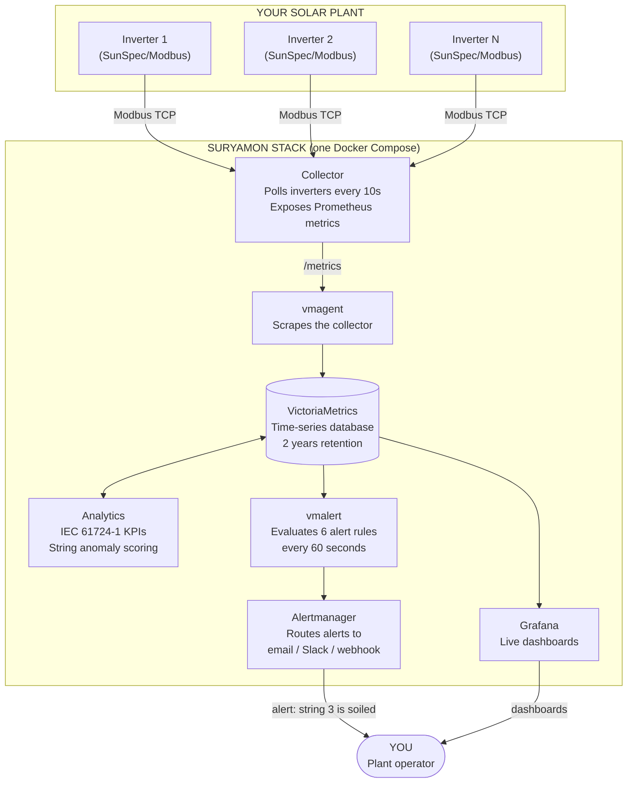
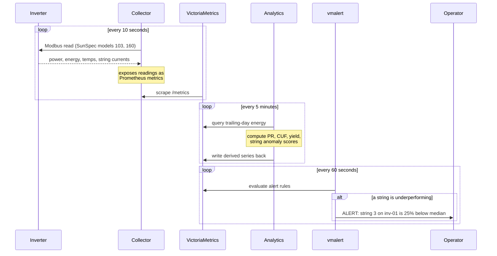
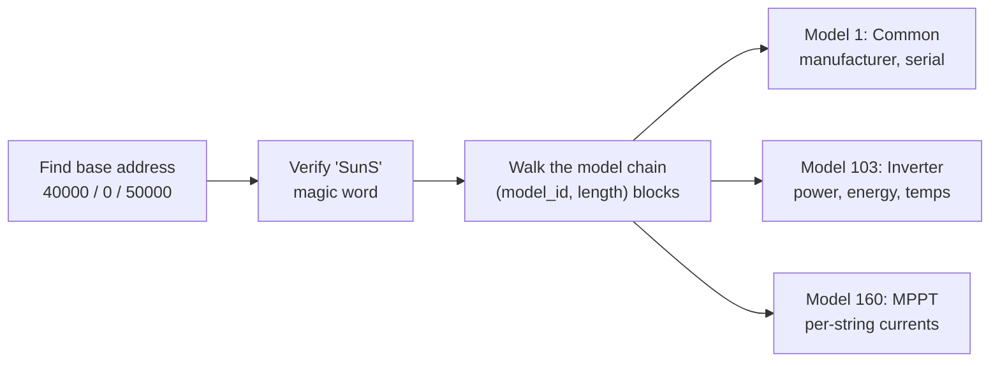

<div align="center">

# Suryamon

### Open source health monitoring for solar power plants.

**From inverter to dashboard in one Docker command. See every watt. Catch every fault. Pay nothing.**

*by [Tech4Biz Solutions](mailto:contact@tech4biz.io)*

</div>

---

## The problem, explained simply

A solar plant is a money machine. Sunlight goes in, electricity comes out, and the electricity earns money.

Every solar plant already measures itself constantly. The inverters (the boxes that convert solar DC power into usable AC power) report data every few seconds: how much power each group of panels produces, how hot the equipment is, how much energy the plant has earned in its lifetime.

Here is the problem: **most plant operators never look at this data.**

- A layer of dust on one section of panels silently cuts output by 5 to 25 percent. Nobody notices for months.
- A single blown fuse kills an entire string of panels. The plant "still works", so nobody checks.
- An inverter overheats and quietly reduces its own output to protect itself. The energy bill shrinks and nobody knows why.

Big utility plants pay expensive commercial platforms to watch for these problems. Small and mid-size operators, the rooftop plants on factories, schools, hospitals, and warehouses, get nothing. The data is right there on the wire, and it goes unread.

**Suryamon reads it.** Free, open source, self-hosted, production-grade.

---

## What Suryamon does, in three sentences

1. **Collects**: it talks to your inverters in their own language (Modbus/SunSpec, the industry standard) and pulls every reading every few seconds.
2. **Computes**: it turns raw readings into the health metrics the solar industry trusts (Performance Ratio, CUF, specific yield, per the IEC 61724-1 standard) and scores every panel string for anomalies.
3. **Alerts**: it tells you the moment something is wrong: a soiled section, a dead string, a degrading inverter, an offline device. Before the losses grow.

You install it with one command. You open one dashboard. You see your plant's health, live.

---

## Architecture

Here is the complete system. Six small services, each doing one job, wired together by Docker Compose.



### The data journey, step by step



### Why this design

Every choice here is deliberate. Full reasoning lives in [docs/architecture.md](docs/architecture.md).

| Decision | Why |
|----------|-----|
| **Prometheus metrics model, not a custom database** | Solar telemetry is time-series data. VictoriaMetrics stores 2 years of it on a Raspberry Pi class machine. We write zero storage code and inherit PromQL, alerting, and Grafana for free. |
| **Collector is a dumb pipe** | It reads registers and exposes gauges. No business logic, no state. Restart it any time, nothing breaks. |
| **Analytics is a batch loop, not a stream processor** | IEC KPIs are periodic aggregates. A 5-minute loop is simple, debuggable, and sufficient. |
| **Honest Performance Ratio** | PR requires irradiance data. Plants without a pyranometer get specific yield only. Suryamon never fabricates a PR number. |
| **Simulator is a first-class component** | Every feature is demonstrable with zero hardware. Contributors and evaluators see alerts fire in minutes. |

---

## Quickstart: real hardware

You need: Docker, and an inverter reachable over the network (Modbus TCP enabled).

```bash
git clone https://github.com/Tech4Biz-Solutions-Pvt-Ltd/suryamon
cd suryamon
cp examples/plant.example.yaml plant.yaml
```

Edit `plant.yaml` to describe your plant. This is the only configuration file:

```yaml
plant:
  name: my-rooftop            # any name you like
  capacity_kwp: 100.0         # your plant's rated DC capacity
  location:
    lat: 12.97                # used for future irradiance features
    lon: 77.59
    tz: Asia/Kolkata

inverters:
  - id: inv-01                # any label you like
    host: 192.168.1.40        # your inverter's IP address
    port: 502                 # Modbus TCP port, 502 is standard
    unit_id: 1                # Modbus unit ID, usually 1
    strings: 8                # number of DC strings on this inverter
```

Then:

```bash
docker compose up -d
```

Open Grafana at **http://localhost:3000** (login: `admin` / `suryamon`). The plant overview dashboard is already provisioned. You are monitoring.

## Quickstart: no hardware at all

Want to see it work before touching a real plant? The built-in simulator emulates a full 100 kWp plant with two SunSpec inverters, a realistic daily sun curve, cloud noise, and one deliberately soiled string:

```bash
cp examples/plant.sim.yaml plant.yaml
docker compose --profile sim up -d
```

Within minutes you will see live production on the dashboard and a **StringUnderperforming** alert firing for the soiled string. That is the whole product demonstrating itself.

---

## What Suryamon measures

### Raw metrics (collected every 10 seconds)

| Metric | Meaning |
|--------|---------|
| `suryamon_ac_power_watts` | AC power the inverter delivers right now |
| `suryamon_dc_power_watts` | DC power arriving from the panels |
| `suryamon_energy_lifetime_wh` | Lifetime energy counter |
| `suryamon_string_current_amps` | DC current of each individual panel string |
| `suryamon_string_voltage_volts` | DC voltage of each individual panel string |
| `suryamon_cabinet_temp_celsius` | Inverter cabinet temperature |
| `suryamon_inverter_status` | SunSpec operating state |
| `suryamon_inverter_up` | 1 if the last poll succeeded, 0 if not |

### Derived KPIs (computed every 5 minutes, per IEC 61724-1)

**Performance Ratio (PR)** answers the most important question in solar: *of the energy the sun offered you today, how much did you actually capture?*

```
Reference yield   Yr = H_poa / G_stc        (hours of full-strength sun received)
Final yield       Yf = E_ac / P0            (hours of full-power output achieved)
Performance Ratio PR = Yf / Yr              (healthy plants: 0.75 to 0.85)
```

A PR of 0.80 means: the sun offered 100 units, you captured 80. A falling PR is the earliest sign of soiling, degradation, or equipment trouble.

**CUF (Capacity Utilisation Factor)**: energy delivered versus the theoretical maximum if the plant ran at full power 24 hours a day. The number financiers and PPAs care about.

**Specific yield (kWh/kWp)**: energy per unit of installed capacity. The fairest way to compare plants of different sizes.

**String anomaly score**: every string's current is compared against the plant-wide median. A healthy string scores 0. A string 25 percent below median scores 0.25. We use the median, not the mean, so a dead string cannot mask itself by dragging the average down.

### The 6 built-in alerts

| Alert | Fires when | Likely physical cause |
|-------|-----------|----------------------|
| **InverterOffline** | No successful poll for 5 min | Network path down, inverter powered off |
| **StringUnderperforming** | Anomaly score > 0.15 for 30 min | Soiling, shading, connector fault |
| **StringDead** | Anomaly score > 0.90 for 15 min | Blown fuse, failed connector, isolation fault |
| **PerformanceRatioDegraded** | Daily PR < 0.75 for 2 h | Systemic soiling, curtailment, clipping |
| **SoilingDrift** | 3-day PR average drops 5% below the 3-week baseline | Gradual dust accumulation. Time to clean. |
| **InverterOverTemperature** | Cabinet > 65 C for 10 min | Blocked ventilation, failed fan |

Every alert annotation names the likely physical cause, because an alert that says *what to go check* is worth ten that only say *something is wrong*.

Alerts route through Alertmanager to wherever you work: email, Slack, Telegram, webhooks. Edit `deploy/alertmanager/alertmanager.yml`.

---

## How the collector speaks SunSpec

SunSpec is the industry-standard information model that nearly every grid-tied inverter implements (SMA, Fronius, Sungrow, Huawei, SolarEdge, and many more). Suryamon implements the client side from the specification:



Scale factors are applied exactly as the specification requires. Register offsets are documented in the source with model and offset numbers, so you can verify every read against the SunSpec documents.

If your inverter is SunSpec-compliant, Suryamon speaks to it today, with zero custom code.

---

## Project layout

```
suryamon/
├── collector/            Python service: SunSpec Modbus -> Prometheus metrics
│   └── suryamon_collector/
│       ├── collector.py  Poll loop, reconnection, metric gauges
│       └── sunspec.py    SunSpec model chain walker and register parser
├── analytics/            Python service: IEC 61724-1 KPI engine
│   └── suryamon_analytics/
│       ├── kpi.py        Pure KPI functions (tested against reference cases)
│       └── service.py    Query -> compute -> write-back loop
├── simulator/            Full SunSpec plant simulator for demos and tests
├── deploy/
│   ├── grafana/          Provisioned datasource and dashboards
│   ├── vmalert/          The 6 alert rules
│   ├── vmagent/          Scrape configuration
│   └── alertmanager/     Alert routing (add your email/Slack here)
├── tests/                Unit + integration tests (wire-level Modbus included)
├── scripts/
│   ├── e2e.sh            Full-stack end-to-end test, one command
│   └── validate_promql.py  Parses every PromQL expression in the repo
├── examples/             Ready-made plant.yaml files
└── docker-compose.yml    The whole stack
```

---

## Testing: how we know it works

We do not ship guesses. Every commit runs two CI stages.

**Stage 1: unit and integration tests** (`pytest tests/`)

- KPI math asserted against IEC 61724-1 reference cases (a 100 kWp plant with 5.5 kWh/m2 of irradiation and 440 kWh output must produce PR = 0.80, exactly).
- String anomaly scoring, including the dead-string edge case.
- **Full SunSpec wire round-trip**: the simulator's Modbus server and the collector's reader talk over real TCP inside the test. Register encoding, model chain walking, and scale factors are all exercised on the wire.
- The analytics service runs end to end against a VictoriaMetrics-compatible API, and the derived series it writes back are asserted to the third decimal.
- Every PromQL expression in every alert rule and every dashboard panel is parsed with a real PromQL parser.

**Stage 2: full-stack e2e** (`./scripts/e2e.sh`)

Brings up the entire Docker stack with the simulator and asserts five integration points: collector metrics, VictoriaMetrics ingestion, derived KPI series, detection of the planted soiled string, and Grafana health.

Run both yourself:

```bash
python -m pytest tests/ -v
./scripts/e2e.sh
```

**A note on pymodbus**: we pin pymodbus to the stable 3.6 line. The 3.7+ series is mid-migration to a new server API with breaking changes. We will move when pymodbus 4.0 stabilises. This is documented, deliberate, and tested.

---

## Roadmap

- [x] SunSpec Modbus TCP collector (models 1, 103, 160)
- [x] IEC 61724-1 PR, CUF, specific yield
- [x] String-level anomaly detection
- [x] 6-rule alert pack with physical-cause annotations
- [x] Grafana dashboard pack
- [x] Full plant simulator
- [x] Wire-level integration tests and full-stack e2e
- [ ] Modbus RTU (serial/RS-485) support
- [ ] MQTT ingest for edge data loggers
- [ ] Satellite irradiance fallback (accurate PR without a pyranometer)
- [ ] Inverter detail dashboard and string heatmap v2
- [ ] Multi-plant fleet view
- [ ] Open hardware RS-485 data logger (schematics + firmware)

Want something on this list sooner? Open an issue, or build it with us: [CONTRIBUTING.md](CONTRIBUTING.md).

---

## FAQ

**My inverter brand is X. Will it work?**
If it implements SunSpec over Modbus TCP (most grid-tied inverters from the last decade do), yes. Check your inverter manual for "SunSpec" or "Modbus TCP". If your device speaks a proprietary protocol, open an issue with the model name.

**Do I need a pyranometer (irradiance sensor)?**
No. Without one you get every metric except Performance Ratio, and you still get specific yield, string anomaly detection, and all alerts. With one (or once the satellite irradiance feature lands), you get true IEC PR as well.

**How much hardware does this need?**
A Raspberry Pi 4 or any small x86 box runs the full stack for a typical plant. VictoriaMetrics is remarkably light.

**Is my data sent anywhere?**
No. Suryamon is fully self-hosted. Your plant data never leaves your network.

**Can I monitor multiple plants?**
Today: one stack per plant. The fleet view is on the roadmap.

---

## License

Apache License 2.0. See [LICENSE](LICENSE). Copyright 2026 Tech4Biz Solutions.

Use it, fork it, run it commercially. Attribution appreciated.

---

## Need more than open source?

Suryamon covers plant-level monitoring for standard inverters. Real portfolios get messier: proprietary protocols, SCADA integration, weather stations, trackers, string combiners, multi-site NOC dashboards, regulatory reporting, and observability stacks that must hold up at utility scale.

**That is our day job.** Tech4Biz Solutions builds production observability platforms for energy and industrial clients: custom collectors for any protocol, Grafana at fleet scale, alerting wired into your operations, and the engineering discipline this repository demonstrates.

If you want custom solar observability, a monitoring platform for your energy portfolio, or an engineering team that restores stuck delivery:

### 📧 contact@tech4biz.io

---

<div align="center">

**Suryamon by Tech4Biz Solutions. Watch every watt. Ship proven systems.**

Tech4Biz Solutions™ is a trademark of Tech4Biz Solutions.

</div>
